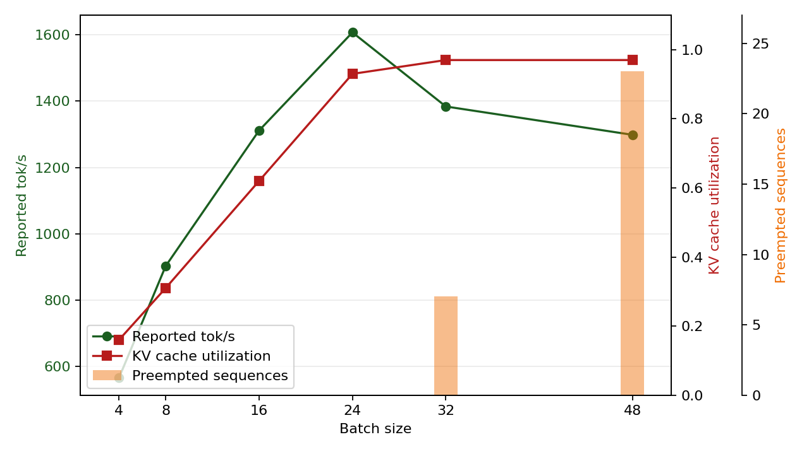

<div align="center">

# FLAM AI Audit Submission
### FlamAI — Software Development Engineer Intern (R&D) Assignment

[](https://www.python.org/)
[](https://numpy.org/)
[](https://pandas.pydata.org/)
[](https://matplotlib.org/)
[](https://github.com/google/sentencepiece)
[](https://huggingface.co/docs/transformers/)
[](https://huggingface.co/docs/datasets/)
[](https://pytest.org/)
[](https://learn.microsoft.com/powershell/)
[](https://github.com/features/actions)
[]()

**Candidate:** M Harish Gautham &nbsp;|&nbsp; **Repository:** FLAM AI audit

</div>

---

## Overview

This repository audits a previous tokenizer-fertility report and a serving
throughput report before leadership uses them for routing and capacity decisions.
It produces a reproducible investigation across three parts:

1. **Part A:** multilingual corpus construction, tokenizer audit, and corrected
   fertility comparison.
2. **Part B:** KV-cache capacity arithmetic, throughput-anomaly diagnosis, and
   output-token goodput reconciliation.
3. **Part C:** a constrained decision memo for multilingual casualization.

The source inputs are checked in under `starter_kit/`. The project keeps the
analysis scripts separate from the written conclusions so every important number
can be rerun and defended.

## Result

The audit finds that the original report is not decision-safe:

| Area | Finding |
|:---|:---|
| Tokenizer metric | `tokens / word` is not a stable cross-language serving-cost metric |
| Real tokenizer comparison | GPT-2 reaches `391.4` Tamil tokens/sentence; XLM-R reaches `39.344` |
| Lowercasing | GPT-2 token counts change from `96` to `99` on the English audit sample |
| Serving counter | `reported_tok_s` includes prompt and generated tokens |
| Long-context goodput | Batch 24 produces approximately `200.9` generated tok/s |
| Capacity anomaly | Preemption begins at batch 32 for the 3,584-token prompt workload |
| Product decision | A small inference-time rewriter is preferred under the stated constraints |

### Result screenshot



The plot shows reported throughput rising through batch 24, then declining as
KV-cache utilization saturates and scheduler preemptions begin.

### A3 tokenizer result

The authenticated 250-sentence FLORES run produced these tokens-per-aligned-
sentence values:

| Tokenizer | English | Hindi | Kannada | Tamil |
|:---|---:|---:|---:|---:|
| GPT-2 | 26.204 | 189.472 | 346.220 | 391.400 |
| XLM-R | 29.540 | 37.048 | 40.020 | 39.344 |

GPT-2 shows severe Indic fragmentation, while XLM-R keeps the four languages
within a much narrower range. Complete metrics are in
`partA/analysis/results.csv` and `partA/analysis/a3_results.json`.

## Curve — Desmos / LaTeX

The long-context throughput graph uses batch size as `x` and reported throughput
as `y`. The exact piecewise-linear equation is generated by
`partB/plot_anomaly.py` and saved to
`partB/plots/throughput_curve.tex`:

```latex
y=\left\{\begin{array}{ll}
84.300000x+228.200000 & 4\le x\le 8\\
51.100000x+493.800000 & 8\le x\le 16\\
37.000000x+719.400000 & 16\le x\le 24\\
-27.925000x+2277.600000 & 24\le x\le 32\\
-5.343750x+1555.000000 & 32\le x\le 48
\end{array}\right.
```

Paste the equation into [Desmos](https://www.desmos.com/calculator) to inspect
the measured rise and long-context throughput collapse.

## Approach (summary)

1. **Preserve evidence boundaries** — audit the supplied scripts and logs instead
   of inventing new benchmark claims.
2. **Control multilingual comparison** — use aligned English, Hindi, Kannada,
   and Tamil text with multiple tokenizers and denominators.
3. **Isolate hypotheses** — each A2 suspicion has its own runnable experiment,
   including a harmless NFC-normalization red herring.
4. **Reconcile serving metrics** — derive KV-cache capacity and distinguish
   prompt-plus-output throughput from generated-token goodput.
5. **Make constrained decisions** — tie the Part C recommendation to GPU time,
   reviewer hours, quality thresholds, latency, and a kill criterion.

## Repo structure

```
flamai-ai-assignment-harish/
├── README.md
├── run_project.ps1
├── requirements.txt
├── starter_kit/
├── partA/
│   ├── corpus/
│   ├── audit/
│   ├── analysis/
│   └── A4_memo.md
├── partB/
│   ├── b1_kv_cache.md
│   ├── b2_anomaly.md
│   ├── b3_goodput.py
│   ├── b4_metric.md
│   └── plots/
└── partC/
    └── memo.md
```

## Reproduce

### Windows PowerShell

```powershell
py -3.11 -m venv .venv
.\.venv\Scripts\Activate.ps1
python -m pip install --upgrade pip
python -m pip install -r requirements.txt
powershell -ExecutionPolicy Bypass -File .\run_project.ps1 -SkipInstall
```

The default runner uses the project `.venv`, downloads the authenticated
250-sentence FLORES corpus, runs the real GPT-2/XLM-R tokenizer comparison,
reconciles serving goodput, generates the anomaly plot and LaTeX equation, then runs Ruff and Python
compilation checks. It also validates and reports the Part C decision memo;
Part C is a written decision artifact, not a generated numeric output.

For an offline run using the bundled corpus and SentencePiece models:

```powershell
powershell -ExecutionPolicy Bypass -File .\run_project.ps1 -SkipInstall -Offline
```

### Individual analysis commands

```powershell
\.venv\Scripts\python.exe partA/analysis/corrected_fertility.py --mode reference
\.venv\Scripts\python.exe partB/b3_goodput.py --batch-size 24 --prompt-len 3584
\.venv\Scripts\python.exe partB/plot_anomaly.py
```

The authenticated Hugging Face path evaluates GPT-2 and XLM-R on the aligned
FLORES corpus. This run has been completed successfully. Use the project
virtual-environment interpreter:

```powershell
\.venv\Scripts\python.exe partA/corpus/build_corpus.py --source flores --sample-size 250
\.venv\Scripts\python.exe partA/analysis/corrected_fertility.py --mode real
```

Hugging Face setup, when needed:

```powershell
\.venv\Scripts\python.exe -m pip install --upgrade "huggingface_hub[cli]"
hf auth login
hf auth whoami
```

Use a Hugging Face account with read access to the selected dataset. After
authentication, the corpus builder downloads and stores the selected aligned
sentence IDs and checksums in `partA/corpus/processed/manifest.json`.

The authenticated online analysis writes the same reproducible artifacts as the
offline path:

- `partA/analysis/results.csv`
- `partA/analysis/a3_results.json`

The runner also writes the visual snapshots:

- `partB/plots/b2_long_context_anomaly.png`
- `partB/plots/throughput_curve.tex`

The offline `--mode reference` workflow remains available for environments
without Hugging Face access or network connectivity.

## Editable evaluation corpus

The bundled aligned text files are in `partA/corpus/reference_flores/`:

- `english.txt`
- `hindi.txt`
- `kannada.txt`
- `tamil.txt`

They can be edited, but all four files must retain the same number of non-empty
lines. After editing, rerun:

```powershell
python partA/analysis/corrected_fertility.py --mode reference
```

The results and memo numbers must then be updated from the regenerated CSV/JSON.

## Output artifacts

- `partA/analysis/results.csv` — tokenizer metrics
- `partA/analysis/a3_results.json` — tokenizer and corpus provenance
- `partB/plots/b2_long_context_anomaly.png` — long-context anomaly plot
- `partB/plots/throughput_curve.tex` — Desmos-ready throughput equation
- `partA/A4_memo.md` — corrected routing recommendation
- `partC/memo.md` — constrained product decision

## Investigation record

- [NOTEBOOK.md](NOTEBOOK.md) — chronological hypotheses, experiments, and revisions
- [AI_USAGE.md](AI_USAGE.md) — documented AI assistance and verification
- [COUNTERFACTUALS.md](COUNTERFACTUALS.md) — defense-oriented what-if analysis
